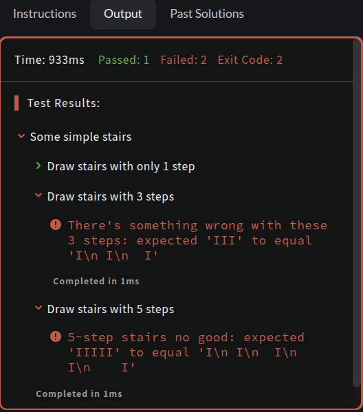

author: Tony Beaumont
summary: Problem Solving: Drawing Stairs
id: problem-03
categories: coding
environments: Web
status: Published
feedback link: mailto:a.j.beaumont@aston.ac.uk

# Problem Solving: Drawing Stairs

## Introduction

This series of problem solving exercises are based on problems found on Codewars [https://www.codewars.com/](https://www.codewars.com/) or Hackerank [https://www.hackerrank.com/dashboard](https://www.hackerrank.com/dashboard).


### What you should already know

You should have attended the previous two problem solving sessions.  You will have learned the outline procedure for solving problems by:
<ol type="i">
<li>Understanding what the problem statement is asking you to do</li>
<li>Using abstraction to identify what is important</li>
<li>Using decomposition to break the problem down into smaller problems.</li>
<li>Solve the smaller problems, one at a time</li>
</ol>
You will get more practice on that today.

### What you'll learn

* How to use **abstraction**
* How to use **decomposition**
* How to use **repetition**

### What you'll need

No specific tools are required, although you will need to make notes so either pencil and paper or a text editor on your laptop.

### What you'll do

You will be presented with a problem.  You will learn how to understand the problem and break the problem down into steps that help you work towards a solution.

##  Problem Description

Todays problem can be found here: [https://www.codewars.com/kata/5b4e779c578c6a898e0005c5](https://www.codewars.com/kata/5b4e779c578c6a898e0005c5).

After the class finishes, you should submit a solution to the problem using the link above.

### Story

We want to output a drawing of some stairs.

### Problem

Given a number n, draw stairs using the letter "I", n tall and n wide, with the tallest in the top left.

### Examples:

We are given two examples.

### Example 1

For example, `n = 3` would return:
```
"I\n␣I\n␣␣I"
```

If you print that string in a `console.log` it would look look like this:
```
I
␣I
␣␣I
```

(**Note** that the **␣** character represents a space and `\n` is a newline.  These characters are part of a group of characters known as "white space" characters and when printed are invisible.  Another white space character is a tab, written as `\t` in Javascript.  The `␣` is only shown here so that we can see and count spaces.  A space intended to be printed like this is part of a string in Javascript so should be surrounded by quote characters.  Note that `""` is an empty string where as `" "` is a string containing one space.

### Example 2

Another example, a 7-step stairs should be drawn like this:
```
I
␣I
␣␣I
␣␣␣I
␣␣␣␣I
␣␣␣␣␣I
␣␣␣␣␣␣I
```

### Code Template

```
function drawStairs(n) {
  // your code here
}
```

## Understanding the problem

1.  Make sure you understand the problem.
1. **Discuss any questions as a group** before continuing. 

## Identify what is important

1.  Make a list of all the features that look important.  Ignore anything that is not essential to solving the problem.  In this problem, look for patterns.
1. **Discuss your solution to this step as a group**.  Does everyone have the same list of important elements or are there differences?  Resolve your differences so everyone agrees what is important.

## Important characteristics of the problem

* The input to the function is `n`, representing the number of steps.
* The function should return the complete string (although we could optionally print it before returning the string).
* We are building up a string containing only the characters; `space`, `I`, and `\n`.  
* There will be exactly `n` occurences of `I` in each string.
* Every `I` except the final one will be followed by a `\n` and a number of spaces to correctly format the string.


## Understand the examples

We are given two examples.  Here they are again.

For example, `n = 3` would return:
```
"I\n␣I\n␣␣I"
```

If you print that string in a `console.log` it would look look like this:
```
I
␣I
␣␣I
```

Another example, a 7-step stairs should be drawn like this:
```
I
␣I
␣␣I
␣␣␣I
␣␣␣␣I
␣␣␣␣␣I
␣␣␣␣␣␣I
```

1.  In the 3-step example we are shown the actual string and what it looks like printed.  In the 7-step example we are only shown what it looks like printed.  Write down what the actual string will be for the 7-step example.
1.  Write down the string generated when `n` is `1`.
1.  Write down the string generated when `n` is `5`.
1.  Do you notice any patterns?

## Explanation of the examples

Lets put the examples in order of the value of `n`.

When `n` is equal to `1`, the return string is:
```
"I"
```

When `n = 3` the return string is:
```
"I\n␣I\n␣␣I"
```

When `n` is equal to `5`, the returned string is:
```
"I\n␣I\n␣␣I\n␣␣␣I\n␣␣␣␣I"
```

When `n` is equal to 7, the returned string is:
```
"I\n␣I\n␣␣I\n␣␣␣I\n␣␣␣␣I\n␣␣␣␣␣I\n␣␣␣␣␣␣I"
```
### Patterns to notice

There are some patterns to note:
* The first character in EVERY returned string is `"I"`
* There is a `\n` following EVERY `I` EXCEPT the last.  Our solution will need a way of knowing when we are adding the last `I` so we don't add too many `\n` characters.
* After the first `I`, there is ALWAYS a sequence of one or more spaces before the next `I`.  Our solution will need a way of calculating the correct number of spaces before the next `I`.  We might note here that there is ONE space after the FIRST `I`, TWO spaces after the SECOND `I`, THREE spaces after the THIRD `I`, and so on.

It is useful to note these patterns because we can use them when designing the solution later.

## Decomposing the problem

1.  Can you decompose this problem into smaller ones?<br/>
	**Hint**: Think about the characters we are adding to the result string. Decomposing a problem is all about not trying to do everything at once.<br/>
	Describe your decomposition in English without reference to programming code of any kind, although you might want to use variable names to refer to certain values. 
1.  Discuss as group the different decompositions you have come up with.  Resolve any differences.
	
## Our decomposition

**Step 1**: There is a simple version of the problem that we can solve first.  Ignore all characters except the `I` and generate and return a string containing the correct number of `I` characters.  This will be our **version 1**.

**Step 2**:  Modify our solution to step 2 so that the correct number of `\n` characters are added.  This will be our **version 2**.

**Step 3**:  Modify our solution to step 1 so that the correct number of spaces are added.  This will be our **version 3** (final version).

## A solution to Step 1

In version 1, we are going to return a string containing only the correct number of `I` characters.
* `n=0` we need to return `""`
* `n=1` we need to return `"I"`
* `n=2` we need to return `"II"`
* `n=3` we need to return `"III"`
* and so on...

Here is a design for version 1.

*  We are building a string so start with a variable called `result` which is an empty string `""`.  We will append all the subsequent characters to `result`.
* If the value of `n` is less than `1`, there is nothing to do, so return `result`.
* Use a variable call `iCount` to count the number of `I` characters we have appended so far, currently its value should be `0`.
* `while` `iCount` is less than `n`, repeat:
  *  Append an `I` to `result`
  *  Increment the value of `iCount` by one
* `return result`

1.  Write the plan above in Javascript and check that it works.  You might need to check the documentation for how to append to a string.  There is more than one way to do that.

## The code for Version 1

Here is the code for version 1:
```javascript
function drawStairs(n) {
	let result = "";
	if (n < 1) return result; // nothing to do, the function returns here
	// we only get past the above line when n >= 1, we don't need an else
	let iCount = 0;
	while (iCount < n) {
		result = result.concat("I");
		// or ...
		// result = result + "I";
		iCount = iCount + 1;
	}
	return result;
}
```

If we run version 1 in codewars we will see the following output:


Version 1 passes the test for `n=1`.  It fails when `n=3` and `n=5` but we expected that.  If you read the message printed for the 3-step test, it says
```console
expected 'III' to equal 'I\n I\n  I'
```
We can see that version 1 is doing exactly what we intended.  In the 3-step test, version 1 returns a string containing three `I` characters.  In the 5-step test, version 1 returns a string containing five `I` characters.

##  Develop a solution to step 2.

Version 2 will return strings containing only `I` and `\n` characters.  Here is what we are aiming at:

* `n=0` we need to return `""`
* `n=1` we need to return `"I"`
* `n=2` we need to return `"I\nI"`
* `n=3` we need to return `"I\nI\nI"`
* and so on...

We note that when we add an `I`, if it was not the last `I`, we add a `\n`.  Here is the relevant code with a comment added:
```
while (iCount < n) {
	result = result.concat("I");
	iCount = iCount + 1;
	// if that wasn't the last I, append a \n
}
```

1.  Write the code indicated by our comment to complete version 2

## Adding a newline

To correctly add a newline when required, we need to add:
```
if (iCount < n) {
	result = result.concat("\n");
}
```

We should test this and check the output is what we expect.

## Developing a solution to step 3

The final version of our code will include space characters.  This is what we are aiming at:
* `n=0` we need to return `""`
* `n=1` we need to return `"I"`
* `n=2` we need to return `"I\n␣I"`
* `n=3` we need to return `"I\n␣I\n␣␣I"`
* and so on...

We should notice that
* the spaces come after the `\n` character for every `I` except the last.
* the number of spaces is the same as the number of `I` characters we have appended so far.

1.  Modify version 2 so that it includes the code to append the correct number of spaces.  **Hint**: The algorithm to use is to count spaces and repeatedly add a space until you have enough.

## Adding the right number of spaces

Here is the code to add the right number of spaces:

```
// add the \n when required
if (iCount < n) {
	result = result.concat("\n");
	// add the spaces too
	let spaceCount = 0;
	while (spaceCount < iCount) {
		result = result.concat(" ");
		spaceCount = spaceCount + 1;
	}
}
```

You might have written the following:
```
// add the \n when required
if (iCount < n) {
	result = result.concat("\n");
}
// now add the spaces
if (iCount < n) {
	let spaceCount = 0;
	while (spaceCount < iCount) {
		result = result.concat(" ");
		spaceCount = spaceCount + 1;
	}
}
```
but we don't need the second `if` statement because both `if` statements test whether `(iCount < n)` and the neither `if` statement changes `iCount` or `n`.  Therefore we can merge the two into one `if` statement.

One `if` statement is simpler than two, simpler is almost always better.

## Summary

The final version of this function is quite complicated:
* It uses the `concat` function.  
* It contains a couple of counting variables.  
* It contains a `while` statement that contains an `if` statement which in turn contains another `while` statement

Our decomposition of the problem into three different steps really helped us here.  It allowed us to solve the problem without really seeing how complex the code was that we were building up.  Each version had a small focussed modification to the previous version.
